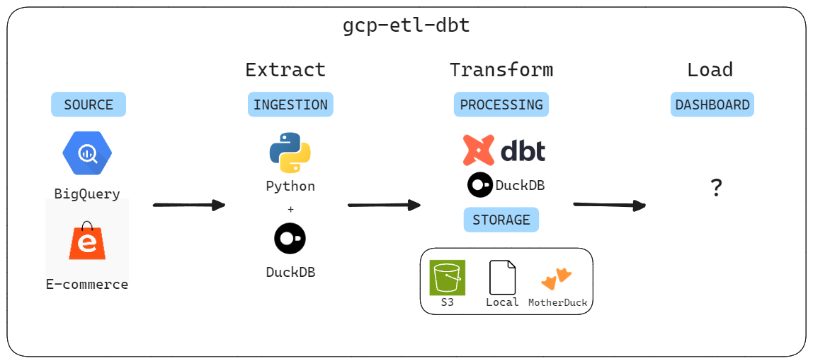

# E-commerce Data Pipeline

This project is a collection of pipelines to get insights from your e-commerce data, specifically using the BigQuery public dataset "thelook_ecommerce".

## High level architecture


## Overview

This project implements a data pipeline that ingests data from the BigQuery public dataset "thelook_ecommerce". The pipeline extracts data from specified tables, validates it using Pydantic models, and loads it into DuckDB. From there, the data can be written to local CSV files, Amazon S3, or MotherDuck.

## Requirements

- Python 3.11
- [uv](https://docs.astral.sh/uv/) for dependency management
- Google Cloud BigQuery

## Setup

Copy `.env.example` and fill in the required values (see **Env & credentials** below).

```bash
make install   # uv sync --group dev
```

## Env & credentials

A `.env` file is required at the project root:

```
S3_PATH=s3://my-s3-bucket
AWS_PROFILE=my-aws-profile
GOOGLE_APPLICATION_CREDENTIALS=path-to-my-creds.json
MOTHERDUCK_TOKEN=mother-duck-token
DESTINATION=local,s3,md
TABLE_NAMES=table-name
GCP_PROJECT=my-gcp-project
TRANSFORM_S3_PATH_INPUT=s3://path-to-my-bucket
TRANSFORM_S3_PATH_OUTPUT=s3://path-to-my-bucket
AWS_ACCESS_KEY_ID=your-access-key-id
AWS_SECRET_ACCESS_KEY=your-secret-access-key
AWS_REGION=us-east-2
DBT_FOLDER=transform/gcp_etl_dbt
DBT_TARGET=dev
```

## Ingestion

Extracts from BigQuery, validates with Pydantic, and loads to DuckDB. Sinks to `local`, `s3`, or `md` based on `DESTINATION`.

```bash
make data-ingestion   # run the pipeline
make pipeline-test    # pytest ingestion/tests
```

## Transformation

The dbt project lives in `transform/gcp_etl_dbt/`. Two targets:

- `dev` — local DuckDB file, reads source parquet from S3
- `prod` — MotherDuck, reads source parquet from S3

```bash
make data-transformation DBT_TARGET=dev    # run dbt against local DuckDB
make data-transformation DBT_TARGET=prod   # run dbt against MotherDuck
make data-transformation-test              # dbt test
make dbt-docs                              # generate and serve dbt docs
```

## Dashboard

Streamlit app reading from `transform/gcp_etl_dbt/dbt.duckdb` (requires `dev` dbt run first):

```bash
make dashboard
```

## Code Quality

```bash
make format   # ruff format
make lint     # ruff check

# Pre-commit hooks (one-time setup):
uv run pre-commit install
```

## CI

Three GitHub Actions jobs run on every push and pull request to `main`:

| Job | What it does |
|---|---|
| `quality` | ruff format check + ruff lint |
| `test-ingestion` | pytest ingestion/tests |
| `dbt-validate` | dbt deps + dbt compile (validates SQL without running) |
