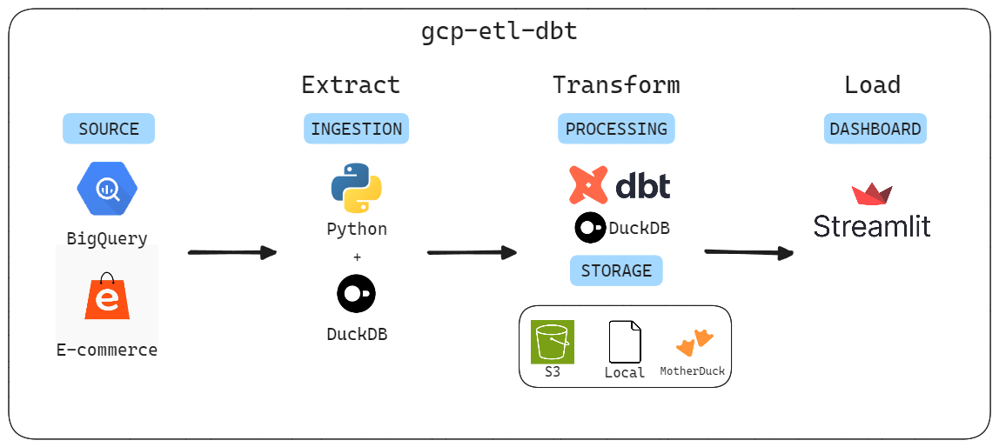

# E-commerce Data Pipeline

This project is a collection of pipelines to get insights from your e-commerce data, specifically using the BigQuery public dataset "thelook_ecommerce".

## High level architecture


## Overview

This project implements a data pipeline that ingests data from the BigQuery public dataset "thelook_ecommerce". The pipeline extracts data from specified tables, validates it using Pydantic models, and loads it into DuckDB. From there, the data can be written to local CSV files, Amazon S3, or MotherDuck.

## Requirements

- Python 3.11
- Poetry for dependency management
- Google Cloud BigQuery

## Development

### Setup

The project uses:
* Python 3.11
* Poetry for dependency management

A `Makefile` is available to run common tasks.

### Env & credentials

A `.env` file is required to run the project. You can copy the `.env.example` file and fill the required values:

```
S3_PATH=s3://my-s3-bucket # output s3 path
AWS_PROFILE=my-aws-profile # aws profile
GOOGLE_APPLICATION_CREDENTIALS=path-to-my-creds.json # path to GCP credentials
MOTHERDUCK_TOKEN=mother-duck-token # MotherDuck token
DESTINATION=local,s3,md # destination path
TABLE_NAMES=table-name # tables to ingest
GCP_PROJECT=my-gcp-project # gcp project name
TRANSFORM_S3_PATH_INPUT=s3://path-to-my-bucket # s3 path to input
TRANSFORM_S3_PATH_OUTPUT=s3://path-to-my-bucket # s3 path to output
AWS_ACCESS_KEY_ID=your-acces-key-id # your acces key id
AWS_SECRET_ACCESS_KEY=your-secret-access-key # your secrect acces key
AWS_REGION=us-east-2 # your amazon region
```

## Module Descriptions

### bigquery.py

This module handles interactions with Google BigQuery.

#### Functions:

1. `build_ecommerce_query(params: EcommerceJobParameters, ecom_public_dataset: str) -> List[str]`
2. `get_bigquery_client(project_name: str) -> bigquery.Client`
3. `get_bigquery_results(queries: List[str], table_names: List[str], bigquery_client: bigquery.Client) -> dict`

### duck.py

This module handles interactions with DuckDB and data writing operations.

#### Functions:

1. `create_table_from_pyarrow_tables(duckdb_con, pyarrow_tables: dict)`
2. `connect_to_md(duckdb_con, motherduck_token: str)`
3. `load_aws_credentials(duckdb_con, profile: str)`
4. `write_to_s3_from_duckdb(duckdb_con, tables: List[str], s3_path: str)`
5. `write_to_md_from_duckdb(duckdb_con, table: str, local_database: str, remote_database: str)`

### models.py

This module defines Pydantic models for data validation and job parameters.

#### Classes:

- `DistributionCenters`, `Events`, `InventoryItems`, `OrderItems`, `Orders`, `Products`, `Users`
- `EcommerceJobParameters`
- `TableValidationError`

#### Functions:

- `validate_table(table: pa.Table, table_name: str)`

### pipeline.py

This module orchestrates the entire ETL pipeline.

#### Functions:

- `main(params: EcommerceJobParameters)`

## Data Flow

1. Extract: Data is queried from BigQuery using the specified table names.
2. Transform: Data is validated using Pydantic models.
3. Load: Validated data is loaded into DuckDB.
4. Sink: Data can be written to local CSV files, Amazon S3, or MotherDuck based on the specified destination(s).

## Ingestion

### Requirements

- [GCP account](https://console.cloud.google.com/)
- AWS S3 bucket (optional to push data to S3) and AWS credentials that has write access to the bucket
- [MotherDuck account](https://app.motherduck.com/) (optional to push data to MotherDuck)

### Run

Once you fill your `.env` file, do the following:
* `make install` : to install the dependencies
* `make data-ingestion` : to run the ingestion pipeline

## Transformation

### Requirements

You can choose to push the data of the transform pipeline either to AWS S3 or to MotherDuck. Both pipelines rely on source data storing on AWS S3 (see Ingestion section for more details).

For AWS S3, you would need:
- [AWS S3 bucket](https://aws.amazon.com/s3/): AWS credentials that has read access to the bucket source bucket and write to the destination bucket

For MotherDuck, you would need:
- [MotherDuck account](https://app.motherduck.com/): AWS IAM user account with read/write access to the source AWS S3 bucket and write access to the destination AWS S3 bucket

### Run

Fill your `.env` file with the required variables.

You can then run the following commands:
* `make install` : to install the dependencies
* `make data-transformation DBT_TARGET=dev` : example of a run reading from S3 and writing to AWS S3  
* `make data-transformation DBT_TARGET=prod` : example of a run reading from S3 and writing to MotherDuck
* `make data-transformation-test` : run the unit tests located in `/transform/gcp_etl_dbt/tests`